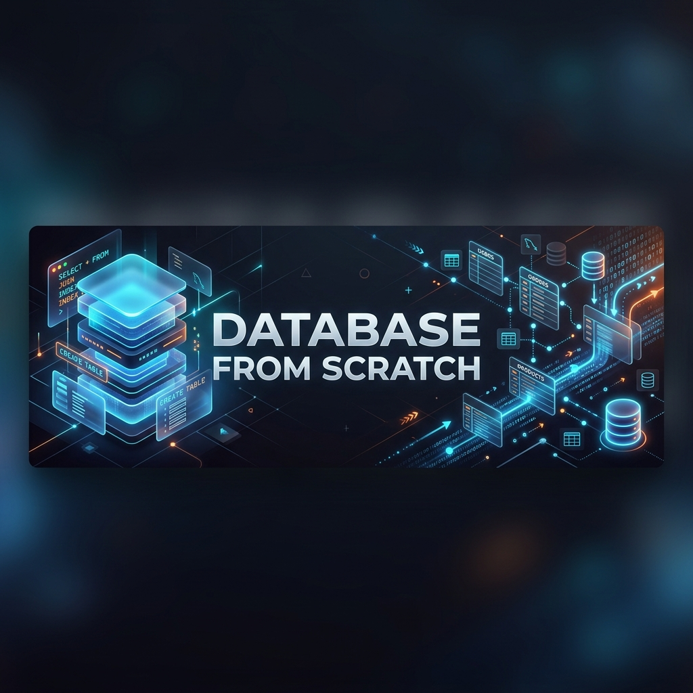

<div align="center">
  
  
  # 🗄️ Database From Scratch
  *A comprehensive journey into the world of Databases and SQL using MySQL.*
</div>

---

Welcome to **Database From Scratch**! This repository is your go-to resource for understanding the fundamentals of Database Management Systems (DBMS), Relational Databases (RDBMS), and mastering SQL commands using MySQL.

Whether you're taking your first steps into data management or brushing up on standard queries, you'll find everything organized into easy-to-follow **Theory** and **Practical** guides.

## 🌟 What's Inside?

### 📚 Theory
Dive deep into core concepts and terminology:
- **[Theory 01](THEORY/Theory01)**: DBMS vs. RDBMS, intro to SQL and MySQL, Database Objects, and Data Definition Language (DDL).
- **[Theory 02](THEORY/Theory2)**: Deep dive into DML (Data Manipulation), DQL (Data Query), TCL (Transaction Control), and DCL (Data Control Language).

### 💻 Practical
Get your hands dirty with real SQL queries and commands:
- **[Practical 01](PRACTICAL/Practical01)**: MySQL basic commands — `SELECT`, `VERSION()`, `NOW()`, user info, math functions, and showing databases.
- **[Practical 02](PRACTICAL/Practical02)**: Creating databases and tables, dropping schemas, inserting data, Primary Keys, and cloning tables with `CTAS` (Create Table As Select).

## 🚀 Getting Started

1. **Install MySQL:** Ensure you have MySQL installed on your system. 
2. **Connect to MySQL:**
   ```bash
   mysql -u root -p
   ```
3. **Run the Commands:** Pick a practical file and start practicing the commands directly in your MySQL monitor.

## 🧠 Key Takeaways
- **DDL:** `CREATE`, `ALTER`, `DROP` (Structure matters!)
- **DML:** `INSERT`, `UPDATE`, `DELETE` (Manipulate your data.)
- **DQL:** `SELECT` (Query your data efficiently.)
- **TCL:** `COMMIT`, `ROLLBACK` (Control your transactions.)

---
*Built with 💙 for data enthusiasts everywhere.*
