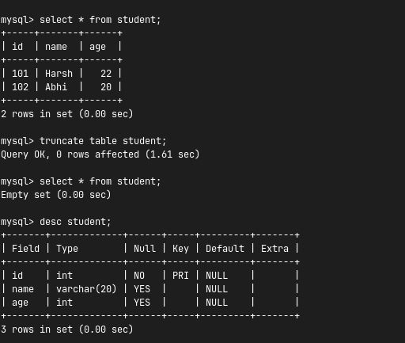
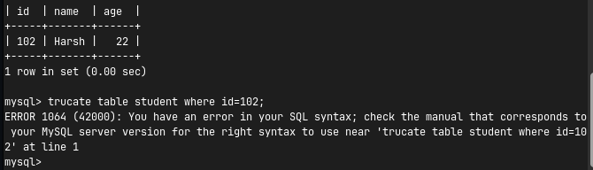
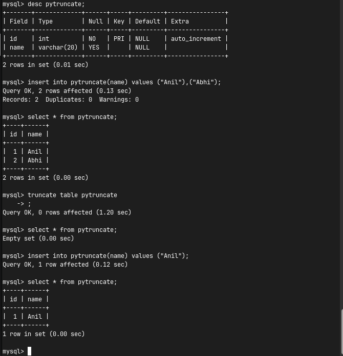

# MySQL Advanced Concepts

This repository provides a comprehensive overview of several advanced MySQL operations, constraints, and commands.

## Table of Contents

- [Auto Increment Gaps](#auto-increment-gaps)
- [INSERT IGNORE](#insert-ignore)
- [INSERT ... ON DUPLICATE KEY UPDATE](#insert--on-duplicate-key-update)
- [SHOW CREATE TABLE](#show-create-table)
- [TRUNCATE Command](#truncate-command)
  - [Why TRUNCATE is considered DDL](#why-truncate-is-considered-ddl)
  - [When to use TRUNCATE](#when-to-use-truncate)
  - [TRUNCATE and Transactions](#truncate-and-transactions)
  - [TRUNCATE and Triggers](#truncate-and-triggers)
- [Upcoming Topics](#upcoming-topics)

---

## Auto Increment Gaps

Gaps in `AUTO_INCREMENT` columns can occur for various reasons. The most common scenario is when rows are deleted. 

**Example Scenario:**
Consider a `STUDENT` table:
1. Anil
2. Bhumi
3. Harsh

If we execute a `DELETE` operation to remove the second record (`ID: 2`):
1. Anil
3. Harsh

When we `INSERT` a new record (e.g., "Abhi"), the ID does not reuse the deleted value:
1. Anil
3. Harsh
4. Abhi

> **Note:** The deleted value is not automatically reused.

---

## INSERT IGNORE

`INSERT IGNORE` is a variation of the `INSERT` statement in MySQL. When attempting to insert new records, if an inserted row violates certain constraints (like `PRIMARY KEY` or `UNIQUE`), MySQL **ignores** that row instead of generating an error. It then continues processing any remaining rows.

**Use Case:** 
This is highly beneficial in real-world scenarios such as importing large datasets or CSV files where duplicate records may already exist in the database.

---

## INSERT ... ON DUPLICATE KEY UPDATE

This is a MySQL-specific extension of the `INSERT` statement. It allows you to insert a new record into a table with a fallback mechanism. If the inserted row violates `PRIMARY KEY` or `UNIQUE KEY` constraints, MySQL **updates** the existing record instead of throwing an error.

**Example:**
```sql 
INSERT INTO student VALUES (101, "Abhi", 20) 
ON DUPLICATE KEY UPDATE name="Harsh", age=22;
```

---

## SHOW CREATE TABLE

`SHOW CREATE TABLE` is a command used to display the exact SQL statement that was originally used to create an existing table. It reveals the complete structure, including constraints, keys, and character sets.

**Example:**
```sql 
SHOW CREATE TABLE student;
```

---

## TRUNCATE Command

The `TRUNCATE` command is used to quickly remove all rows from a table at once.

**Example:**
```sql
TRUNCATE TABLE tablename;
```



### Why TRUNCATE is considered DDL

`TRUNCATE` is classified as a Data Definition Language (DDL) operation rather than a Data Manipulation Language (DML) operation (like `DELETE`). 

- It operates at the **table level** and deallocates or resets the table's data storage, rather than processing and logging individual row deletions.


- It **does not** accept a `WHERE` clause.
- It **does not** delete the table's structure.
- It **resets** the `AUTO_INCREMENT` value (unlike `DELETE`, which normally preserves the increment sequence).



### When to use TRUNCATE

You should opt for `TRUNCATE` over `DELETE` when:
- You want to completely empty a table and do not need any of the existing rows.
- The table is temporary and needs a quick reset.
- You need a faster alternative to `DELETE` (since it does not log individual row deletions).

### TRUNCATE and Transactions

Executing a `TRUNCATE` command causes an **implicit commit**. Because of this, it cannot be rolled back in a transaction, unlike standard DML operations.

### TRUNCATE and Triggers

The `TRUNCATE` command **does not** fire any `DELETE` triggers associated with the table.

---

## Upcoming Topics (On Hold)

- `TRUNCATE` vs `DELETE`
- `TRUNCATE` vs `DROP`
- `TRUNCATE` and `Foreign Keys`