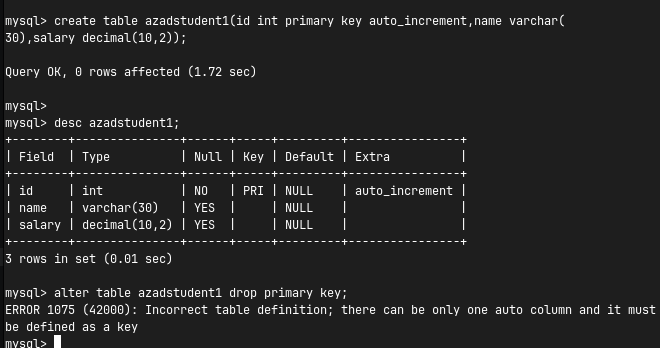

# Database Object Modification and Deletion

## DROP

`DROP` is a DDL command. When we use `DROP`, the object itself is deleted along with all the data stored inside it.

```sql
DROP TABLE copy2;
```
After the `DROP` command, the table will no longer exist.

### Drop Multiple Tables
```sql
DROP TABLE pyemployee1, pyemployee3, pyemployee5;
```
```sql
DROP TABLE IF EXISTS pyemployee1, pyemployee3, pyemployee5;
```

---

## DROP vs TRUNCATE

**TRUNCATE** is used to remove all rows from the table while keeping the table structure.
- Data is removed, but the structure is retained.
- It resets the `AUTO_INCREMENT` counter.
- Does not support the `WHERE` clause because it removes all rows.
- It's a DDL command, so it cannot be rolled back.

**DROP** is used to remove the entire table.
- Both data and structure are removed.
- The table itself is removed, including its `AUTO_INCREMENT` counter.
- Does not support the `WHERE` clause because it removes the entire table.
- It's a DDL command, so it cannot be rolled back.

---

## ALTER

`ALTER` is a DDL command used to modify the structure of an existing database object. It allows us to change an existing table without dropping and recreating the entire table.

We can use the `ALTER` command to:
- Add a new column
- Drop a column
- Modify a column's data type
- Change a column's definition
- Rename a column
- Rename a table
- Add constraints
- Drop constraints
- Add and drop a primary key
- Add and drop a foreign key

`ALTER TABLE` is one of the mechanisms used to evolve the database schema.

### Syntax:
```sql
ALTER TABLE table_name alter_operation;
```

### 1. Add Column
```sql
ALTER TABLE table_name ADD COLUMN column_name datatype;
```
```sql
ALTER TABLE azadi ADD COLUMN email VARCHAR(20);
```
Existing rows will have a `NULL` value in the newly added column when no applicable default is supplied.

**Add Multiple Columns:**
```sql
ALTER TABLE azadi 
ADD COLUMN mobile VARCHAR(20), 
ADD COLUMN course VARCHAR(30), 
ADD COLUMN salary DECIMAL(10,2);
```

**Add Column at a Specific Position:**
By default, a new column is added at the end, but MySQL allows positioning.
```sql
ALTER TABLE azadi ADD COLUMN gender VARCHAR(10) FIRST;
```
```sql
ALTER TABLE azadi ADD COLUMN dob DATE AFTER name;
```
*(Note: Column order has no business significance.)*

### 2. Drop Column
Used to permanently remove a column from the table.
```sql
ALTER TABLE azadi DROP COLUMN dob;
```

**Drop Multiple Columns:**
```sql
ALTER TABLE azadi DROP COLUMN mobile, DROP COLUMN course;
```

### 3. Modify Column
Used to change the definition of an existing column.
```sql
ALTER TABLE table_name MODIFY COLUMN column_name new_definition;
```
```sql
ALTER TABLE azadi MODIFY COLUMN age SMALLINT;
ALTER TABLE azadi MODIFY COLUMN name VARCHAR(30);
```

**Modify Constraints:**
`MODIFY` can change different aspects of a column's definition.
```sql
ALTER TABLE azadi MODIFY COLUMN name VARCHAR(30) NOT NULL;
```
```sql
ALTER TABLE azadi MODIFY COLUMN salary DECIMAL(10,2) DEFAULT 1000;
```

### 4. Change Column
`CHANGE COLUMN` can be used to rename a column or change its definition.
```sql
ALTER TABLE table_name CHANGE COLUMN old_name new_name datatype;
```
```sql
ALTER TABLE azadi CHANGE COLUMN name full_name VARCHAR(30);
```

Alternatively, to only rename:
```sql
ALTER TABLE azadi RENAME COLUMN name TO full_name;
```

### 5. Rename Table
```sql
ALTER TABLE old_table_name RENAME TO new_table_name;
```
```sql
ALTER TABLE azadi RENAME TO hamariazadi;
```
```sql
RENAME TABLE hamariazadi TO sabkiazadi;
```

### CHANGE vs MODIFY
- **MODIFY** is used when we want to change the definition but keep the same column name.
- **CHANGE** is used when we want to rename the column and redefine it.

---

## Primary Key Modifications

### Add Primary Key
```sql
ALTER TABLE azadstudent ADD PRIMARY KEY(id);
```

### Remove Primary Key
```sql
ALTER TABLE azadstudent DROP PRIMARY KEY;
```

**If a key with auto_increment exists:**

If the `PRIMARY KEY` column is also `AUTO_INCREMENT`, we cannot directly remove the `PRIMARY KEY` because MySQL requires an `AUTO_INCREMENT` column to be indexed.

---

> **Topics to be covered later:**
> - Add and Drop UNIQUE Constraints using ALTER
> - Foreign Key using ALTER
> - CHECK Constraints using ALTER
> - DEFAULT using ALTER

> **Homework:**
> Create a table with 5 records containing `id`, `name`, and `salary`. Then add a `PRIMARY KEY` and `AUTO_INCREMENT` using `ALTER TABLE`. After that, insert a new record without specifying the `id`. What ID will MySQL automatically assign?
