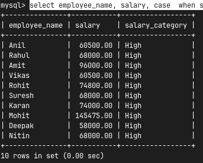

## MULIPLE COLUMN UPDATES

We can update multiple columns in same.

```SQL
UPDATE employeesup set salary=2000,city='Bhopal',department="hr" where employee_id=5;
```

<br>

### UPDATE Using COMPAIRISION OPERATOR;

```sql
mysql> update employeeup set salary=55000 where salary<50000;
```

```
update employeeup set salary=90000 where experience = 5;
```

**_1) Write a query to give 5000 increment to IT employees having atleast 5 years of experience._**

```sql
update employeeup set salary=salary+50000 where department="it" and experience >= 5;
```

**_ii) Write a query to give increment of 3000 to employee of HR or FINANCE department._**

```sql
mysql> update employeeup set salary=salary+3000 where department="HR" or department="Finance";
```

**_iii) give increment of 4000 to three deparments using IN._**

```sql
update employeeup set salary=salary+3000 where department in ("HR","Finance","Sales");
```

**_iv) Write a query to give increment of 10000 to all the employees outside HR and Finance department._**

```sql
update employeeup set salary=salary+10000 where department not in ("HR","Finance");
```

**_v) WAQ to increment 7000 to all the employees whose salary is between 60000 and 70000_**

```sql
update employeeup set salary=salary+7000 where salary between 60000 and 70000;
```

**_vi) WAQ to move all employees to it department whose name start with A._**

**_vii) WAQ to update all the employee cities to goa, who do not have is any city_**

```sql
update employeeup set city = "Goa" where city is null;
```

**_viii) WAQ to give increment of 10% to all it employees_**

```sql
update employeeup set salary= salary*1.1 where department='it';
```

**_ix)WAQ to give 15% increment to it employees having more than 5 years of experience and salary below 80000_**

```sql
update employeeup set salary= salary*1.15 where department='it' and experience >= 5 and salary < 80000;
```

**_x) WAQ to give 10% increment to those employeess whose joined before 2020_**

```sql
update employeeup set salary= salary*1.10 where joining_date < "2020-01-01";
```

<br><br>

## CASE STATEMENTS

Case is a conditional expression in my sql used to return different values based of different conditions.
It works similar to if else in programming language.

```sql
case
    when condition1 then result1
    when condition2 then result2
    else result
end
```

```sql
select employee_name, salary, case  when salary >= 12000 then 'High' when salary >= 60000 then 'medium' else 'low' end as salary_category from employeeup;
```



### CASE with ORDER BY:

Case with ORDER BY used when we want custom shorting instead of normal alphabetical or numerical shorting.

```sql
select employee_name,department, salary from employeeup order by  case  when department = 'IT' then 1 when department = 'HR' then 2 when department = 'Finance' then 3 else '4' end;
```


**_WAQ to give 10% increment to IT department 8% to HR department , and 7% to finance department_**

```sql
update  employeeup set salary= case  when department = 'IT' then salary*1.1  when department = 'HR' then salary*1.07  when department = 'Finance' then salary*1.06  else '4' end;
```

WAQ to give increment of 15% whose experience is greater than 8year, give increment of 10% whose experience is greater than 5 , give increment of 7 % whose ex is greater then 3 year , else 5%

```sql
update  employeeup set salary= case  when experience>8 then salary*1.15  when experience>5 then salary*1.10  when experience>3 then salary*1.07  else salary*1.05 end;
```
